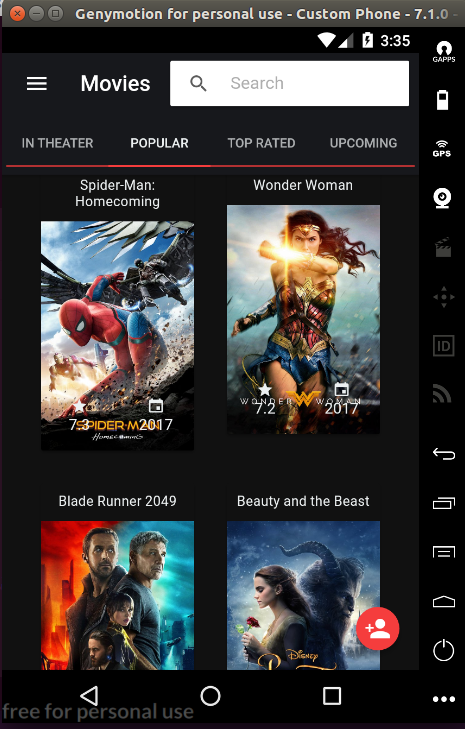
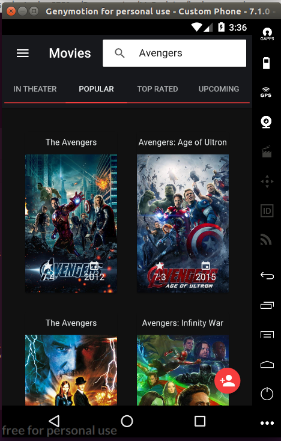
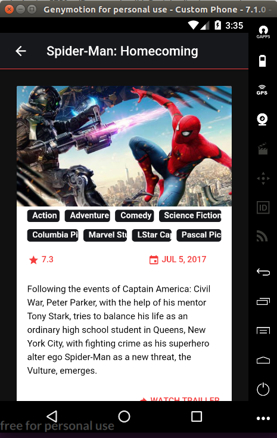
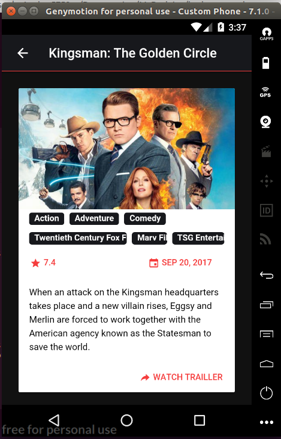
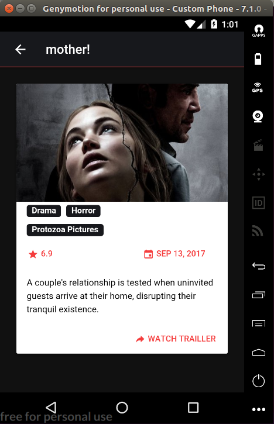
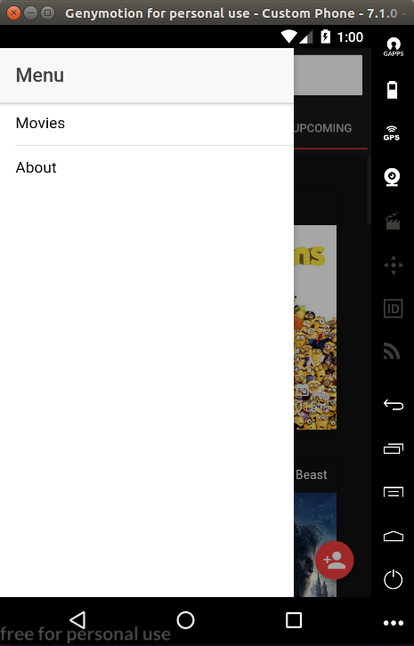
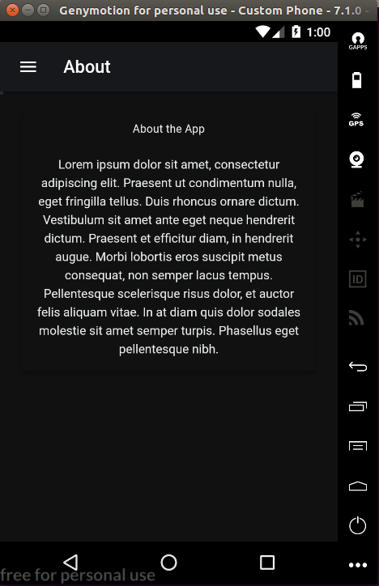
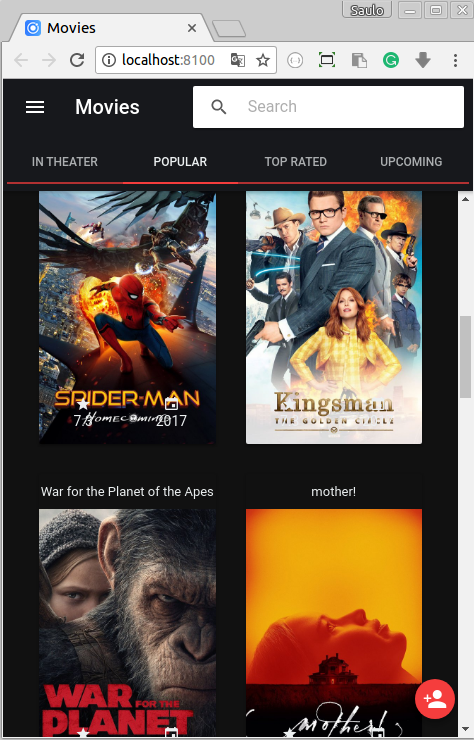
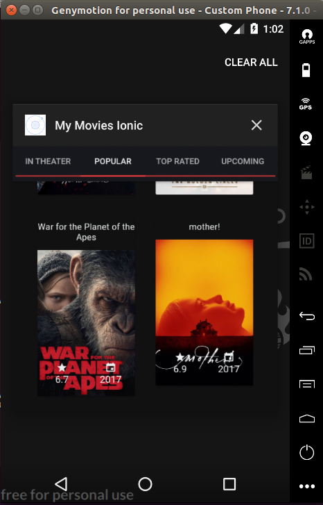

# Ionic My Movies
This is a simple app made with [Ionic Framework](http://ionicframework.com/).

Using [The Movie DB API](https://www.themoviedb.org), It allows user to search for any movie.

## Installation 
If you would like to download the code and try it for yourself:

*please, notive that you might have ionic installed already

1. Clone the repo: https://github.com/saulobr88/ionic-my-movies.git
2. cd ionic-tmdb
3. Install packages: npm install
4. Build project and launch: ionic serve
5. Open your browser at: http://localhost:8100

## Installation Android
* ionic cordova run android

# Screenshot

## Original Author
[Vitor Lima](https://vitorsilvalima.github.io/)

## License
[MIT](https://github.com/saulobr88/ionic-my-movies/blob/master/License)
